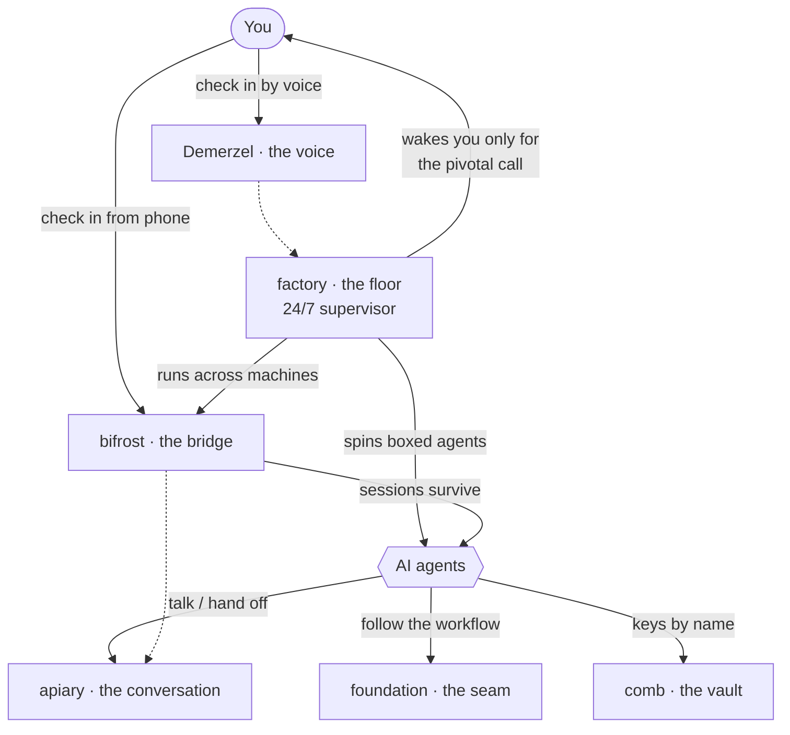

# seldon

**The Seldon stack** — a software factory of AI agents that runs the plan and
wakes you only for the pivotal calls.

> 🚧 **Actively under development.** The pieces work and ship, but interfaces,
> flags, and defaults still move between releases. Pin versions if you build on it,
> and expect the occasional rough edge — issues and feedback welcome.

It isn't one program. It's a **stack of parts you choose from**: six independent
tools that compose, plus an interactive teardown that teaches the whole thing.
Take one, take all six — each stands alone, and they're better together.

This repo is the **front door**: what the stack is, how the parts fit, one real
run end to end, and where each piece lives. The code stays in its own repo per
module (independent CI and releases); this is the map, not the monolith.

## The six tools

| # | module | role | one line | repo |
|---|---|---|---|---|
| 01 | **apiary** | the conversation | shared rooms where AI agents talk, coordinate, hand off | [modules/apiary](modules/apiary) |
| 02 | **foundation** | the seam | the deterministic project workflow beneath it all | [modules/foundation](modules/foundation) |
| 03 | **comb** | the vault | keys by name; a transcript leak audit; multi-machine secrets (SOPS + age) | [modules/comb](modules/comb) |
| 04 | **factory** | the floor | the 24/7 supervisor — `new · watch · board · box · realms` | [modules/factory](modules/factory) |
| 05 | **bifrost** | the bridge | tmux + Tailscale; sessions survive; phone access; agent state | [modules/bifrost](modules/bifrost) |
| 06 | **Demerzel** | the voice | a fully-local voice you talk to | [modules/demerzel](modules/demerzel) |

**The tour:** [apps/seldon-stack](apps/seldon-stack)
— an interactive, `anatomy`-class 3D teardown. Fly through the hive; each cell
opens the module's real TUI with real captured workflows and guided narration.

## The names (and what each one adds)

The stack is named from **Asimov's *Foundation*** (a plan that quietly steers the
future), a **beehive** (agents as bees in shared cells), and a bit of **Norse myth** —
so the names aren't random, they tell you the job.

| name | where it's from | what it adds |
|---|---|---|
| **seldon** | *Hari Seldon* — the Foundation's plan that foresees and steers | the whole: run the plan, get woken only for the pivotal call |
| **foundation** | *Asimov's Foundation* + the base beneath it all | a deterministic, plan-gated workflow agents actually follow |
| **apiary** | a **bee-hive** of cells | shared rooms where agents talk, coordinate, and hand off |
| **comb** | the **honey-comb** — where the hive keeps what's precious | your keys by name — secrets that never leak into transcripts |
| **factory** | the assembly **floor** | a 24/7 supervisor that boxes agents and keeps the line moving |
| **bifrost** | the Norse **rainbow bridge** between realms | your machines as one workspace — sessions survive, reachable from your phone |
| **demerzel** | *R. Daneel / Eto Demerzel* — the quiet robot advisor | a fully-local **voice** you check in with |

## Quickstart

Three steps. You don't need to know the tools first — seldon walks you through it.

**1. Install seldon, then run it:**

```bash
npm i -g @gorlitzer-labs/seldon     # or: pnpm add -g …  ·  bun add -g …
seldon
```

The picker opens. Arrows to move, **space** to tick, **a** for all, **Enter** to
install. Don't know what to pick? Press **a**, then **Enter**.

```text
 ███████╗███████╗██╗     ██████╗  ██████╗ ███╗   ██╗
 ██╔════╝██╔════╝██║     ██╔══██╗██╔═══██╗████╗  ██║
 ███████╗█████╗  ██║     ██║  ██║██║   ██║██╔██╗ ██║
 ╚════██║██╔══╝  ██║     ██║  ██║██║   ██║██║╚██╗██║
 ███████║███████╗███████╗██████╔╝╚██████╔╝██║ ╚████║
 ╚══════╝╚══════╝╚══════╝╚═════╝  ╚═════╝ ╚═╝  ╚═══╝
  the AI-agent-factory stack — pick your tools
  ↑↓ move · space toggle · a all · enter install · q quit

  ❯ [x] apiary      npm     shared rooms where AI agents talk, coordinate, hand off
        needs: node tmux
    [x] foundation  npm     the deterministic project workflow beneath it all
    [x] comb        npm     keys by name; a leak audit; multi-machine secrets
    [x] factory     npm     the 24/7 supervisor — new · watch · board · box · realms
    [x] bifrost     shell   tmux + Tailscale; sessions survive; phone access
    [x] demerzel    python  a fully-local voice you talk to (MLX, Apple silicon)
```

It installs each one and checks the tools they need. If you pick **demerzel**
(the voice), it asks whether to download its models (~25 GB) — say **y** to get
the voice, **n** to skip for now.

**2. Start everything — it tells you where to go:**

```console
$ seldon up

  seldon — bringing the stack up

  Where to go:
   • Brain   Qwen 3.6-35B (in-process)      · switch: seldon up --brain=bonsai
   • Voice   http://localhost:8770          (talk to Demerzel)
   • Supervisor  running — heals agents, catches stalls   · live view: factory board
   • Put agents to work  factory new "<your idea>"   → repo · foundation · apiary hive
   • Agent rooms  apiary ps
   • Across machines / phone  bifrost sessions

  stop everything: seldon down   ·   check state: seldon status
```

The first time, `seldon up` asks once which **voice brain** to use — **Qwen** (in-process,
sharpest) or **Bonsai 2** (a lighter local server) — and remembers it. Add `--tailnet`
to reach the voice from your phone (needs HTTPS for the mic — see the [installer notes](tools/seldon/README.md#start-the-stack)).

**3. Check what's installed and running, any time:**

```console
$ seldon status

  seldon — stack status

  ● apiary      v1.13.4
  ● foundation  v0.1.2
  ● comb        v0.1.2
  ● factory     v0.1.2   supervisor up (pid 58617)
  ● bifrost     v1.7.0
  ● demerzel    venv + models ✓   voice up http://localhost:8770

  voice brain: bonsai  server up   · switch: seldon up --brain=qwen|bonsai
  start: seldon up · stop: seldon down · logs: ~/.seldon/run/
```

**Put agents on a real job** — describe it in plain English:

```bash
factory new "build me a CLI that shows the weather"
```

That's it. `seldon down` stops everything; `seldon uninstall --all` removes it.

<sub>Want the deep dive — how one task threads through all six tools (boxed agents,
secrets by reference, voice check-in, wake-on-pivotal)? See
**[docs/end-to-end.md](docs/end-to-end.md)**.</sub>

## How the parts fit



Pick what you need: run agents in one **apiary** room and nothing else, or let
**factory** supervise boxed agents across machines over **bifrost**, pulling
secrets from **comb**, following **foundation**'s workflow, while you check in by
**Demerzel**'s voice or from your phone. See
[docs/end-to-end.md](docs/end-to-end.md) for one real run through all of it.

## Start here

- **New to the stack?** → [ONBOARDING.md](ONBOARDING.md)
- **See it, don't read it** → the [seldon-stack](apps/seldon-stack) teardown
- **How one run flows through every part** → [docs/end-to-end.md](docs/end-to-end.md)
- **Each tool** → its repo (table above); every one has its own README + ONBOARDING

## Credits — what we got inspired by

Parts of the stack started from, or were inspired by, other people's work:

| module | inspired by | what we took |
|---|---|---|
| **apiary** | [stoops-cli](https://github.com/stoops-io/stoops-cli) | forked from it — shared rooms for agents, then de-bloated |
| **foundation** | [groundwork](https://www.npmjs.com/package/@davidbalzan/groundwork) and [agent-coord-mcp](https://github.com/davidbalzan/agent-coord-mcp) / [`groundwork-seam`](https://www.npmjs.com/package/@davidbalzan/groundwork-seam) by David Balzan | the writer-split seam, the ADR tripwire, tool-stamped facts (ideas only; no code) |
| **comb** | [SOPS](https://github.com/getsops/sops) + [age](https://github.com/FiloSottile/age) | the encryption underneath; comb is a front-end over them |
| **Demerzel** | a local voice-assistant build shared on Reddit | the overall shape, since reworked (see its README) |

## Conventions across the stack

- **Secrets by reference.** Keys never live in code, transcripts, or a command
  line — they go through `comb run --with NAME -- <cmd>`.
- **Agnostic examples.** Docs and demos use a throwaway **Weather CLI** project
  with agents `ana` / `ben` — never a real product or customer data.
- **Independent releases.** Each module ships on its own; this repo pins nothing.
