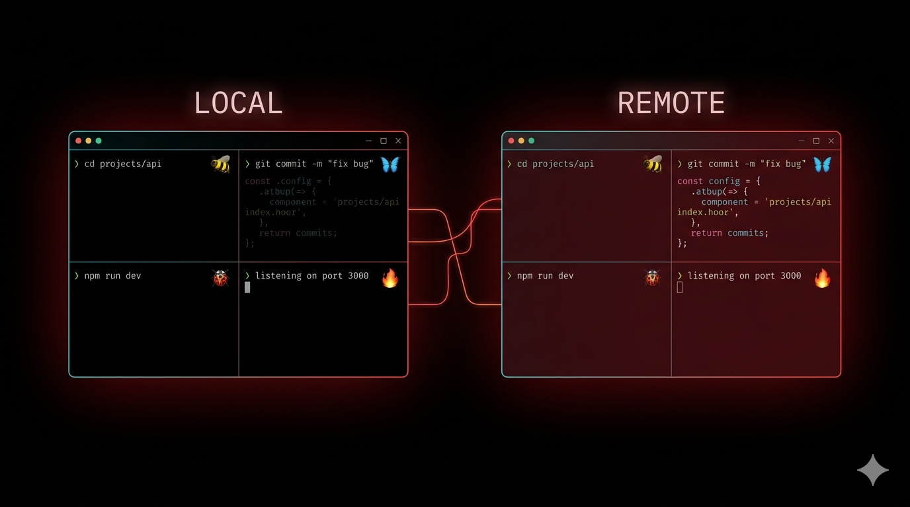

# Bifrost

<p align="center">
  
</p>

> *Bridge between realms. Multi-machine terminal workspace over Tailscale.*

---

Bifrost turns your Tailscale network into a unified terminal workspace. Add devices, launch multi-pane grids, and hop between sessions from any machine or your phone. Each pane is its own tmux session with auto-reconnect — work on desktop, pick up from your phone.

## Architecture

Bifrost has three roles:

```
  CONTROLLER                    The machine running bifrost.
  (your primary Mac)            Orchestrates everything.
  ┌──────────────────────────────────────────────────────┐
  │                                                      │
  │  bifrost workspace                                   │
  │       │                                              │
  │       ├── local-1..4       (sessions here)           │
  │       ├── SSH ──→ asgard-1..4                        │
  │       └── SSH ──→ tatooine-1..4                      │
  │                                                      │
  │  One iTerm window per device, each a 2x2 grid:      │
  │                                                      │
  │  LOCAL (black)   ASGARD (red)   TATOOINE (blue)      │
  │  ┌─────┬─────┐  ┌─────┬─────┐  ┌─────┬─────┐       │
  │  │🐝 1 │🦋 2 │  │🔥 1 │🌀 2 │  │💎 1 │🚀 2 │       │
  │  ├─────┼─────┤  ├─────┼─────┤  ├─────┼─────┤       │
  │  │🐞 3 │🪲 4 │  │⚡ 3 │🎯 4 │  │🌊 3 │🍄 4 │       │
  │  └─────┴─────┘  └─────┴─────┘  └─────┴─────┘       │
  └──────────────────────────────────────────────────────┘
                         │                │
                   Tailscale SSH    Tailscale SSH
                         │                │
  DEVICE                 ▼                ▼         DEVICE
  ┌────────────────────────┐  ┌────────────────────────┐
  │  asgard (Mac)          │  │  tatooine (Linux)      │
  │  Just needs: tmux      │  │  Just needs: tmux      │
  │  Sessions created by   │  │  Sessions created by   │
  │  controller over SSH   │  │  controller over SSH   │
  └────────────────────────┘  └────────────────────────┘
               ▲                         ▲
               │          SSH            │
               └───────┬─────────────────┘
                       │
  CLIENT               │
  ┌────────────────────────┐
  │  Phone / iPad / etc    │
  │                        │
  │  Option A (easy):      │
  │    ssh controller      │
  │    bifrost gateway     │
  │    → pick a session    │
  │    → auto-hops there   │
  │                        │
  │  Option B (direct):    │
  │    ssh asgard          │
  │    tmux attach -t      │
  │      asgard-2          │
  └────────────────────────┘
```

| Role | What it does | What to install |
|---|---|---|
| **Controller** | Runs bifrost, manages all devices and sessions | bifrost + tmux + iTerm2 + Tailscale |
| **Device** | Hosts tmux sessions created by the controller | tmux only (nothing else) |
| **Client** | Connects to existing sessions from anywhere | SSH only (bifrost optional) |

## Install

```bash
# On the controller (your primary Mac)
cp bifrost ~/bin/
chmod +x ~/bin/bifrost
bifrost doctor    # checks prerequisites
```

```bash
# On devices — just tmux
brew install tmux    # macOS
sudo apt install tmux  # Linux
```

## Quick start

```bash
# 1. Check your system
bifrost doctor

# 2. See what's on your Tailscale network
bifrost device scan

# 3. Add devices
bifrost device add asgard
bifrost device add tatooine

# 4. Launch workspaces
bifrost workspace

# 5. From your phone — SSH into the controller
ssh my-mac
bifrost gateway            # interactive session picker
bifrost sessions           # visual map of everything
bifrost attach tatooine-2  # jump directly to a session
```

## Session naming

Session names are `<device-name>-<1..4>`. The device name is whatever you choose when adding it:

```
bifrost device add asgard    →  asgard-1, asgard-2, asgard-3, asgard-4
bifrost device add tatooine  →  tatooine-1, tatooine-2, tatooine-3, tatooine-4
local (always)               →  local-1, local-2, local-3, local-4
```

## Commands

### Setup & diagnostics

```bash
bifrost device scan             # discover Tailscale devices
bifrost device add <name>       # add a device (with SSH key setup)
bifrost device remove <name>    # remove a device
bifrost device list             # show all devices and status
bifrost doctor                  # check prerequisites everywhere
```

### Launch (macOS + iTerm2)

```bash
bifrost workspace               # 2x2 grid — one window per device
bifrost mobile                  # tmux tabs (reattach from phone)
bifrost direct                  # side-by-side split panes (no tmux)
```

### Connect (works everywhere)

```bash
bifrost gateway                 # interactive session picker (phone)
bifrost sessions                # visual map of all sessions
bifrost attach <session>        # jump to a session
bifrost run <device> <cmd>      # run a command on a device
bifrost status                  # connectivity + session overview
```

### Cleanup

```bash
bifrost kill                    # tear down all tmux sessions everywhere
```

## From your phone

**Option A — Gateway (recommended):** SSH into the controller, pick a session:

```bash
ssh my-mac
bifrost gateway
#   1  local-1      controller  ~ (zsh)
#   2  asgard-1     asgard      api (nvim)
#   3  asgard-2     asgard      ~ (claude)
#   4  tatooine-1   tatooine    ~ (zsh)
#
#  Select [1-4]: 3
#  Attaching to asgard-2 @ asgard...
```

Bifrost handles the SSH hop — you only need the controller's address.

**Option B — Direct:** SSH straight into the device:

```bash
ssh asgard
tmux attach -t asgard-2
```

## Modes

### workspace

One iTerm window per device — local always gets black bg, each device gets a distinct color (red, blue, green, amber, purple, teal). Every pane is its own tmux session with a random emoji. Remote panes auto-reconnect on reboot or network drops.

### mobile

iTerm tabs with persistent tmux sessions. Designed for reattaching from phone.

### direct

Single iTerm window, side-by-side splits. No tmux — direct SSH.

## Releasing

Releases are automatic. Just bump the version and push:

```bash
# In the bifrost script, change:
BIFROST_VERSION="1.2.1"  →  BIFROST_VERSION="1.3.0"

# Commit and push to main
git add bifrost && git commit -m "your message" && git push
```

A GitHub Action detects the version change and creates a release with auto-generated notes.

**Semver rules:**
- **Patch** (1.2.0 → 1.2.1) — bug fixes, cleanup
- **Minor** (1.2.0 → 1.3.0) — new features, backward compatible
- **Major** (1.0.0 → 2.0.0) — breaking changes

Users see the update via `bifrost help`:

```
  Update available! 1.2.1 → 1.3.0
  Run: bifrost upgrade
```
