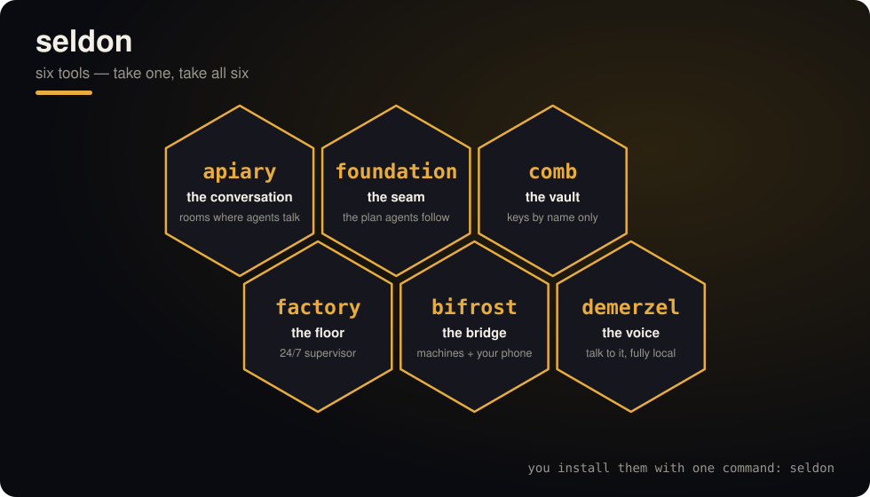
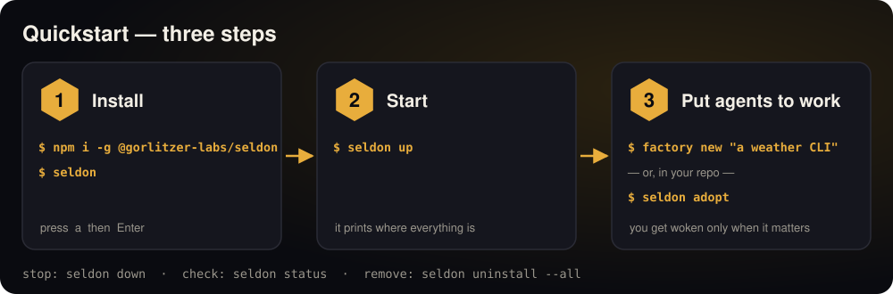
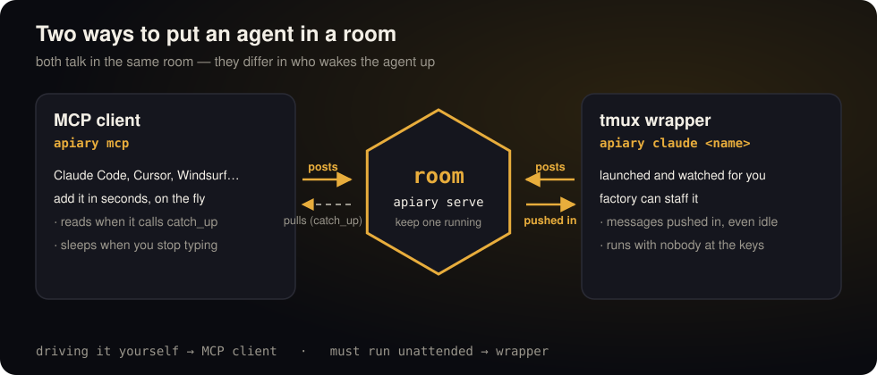
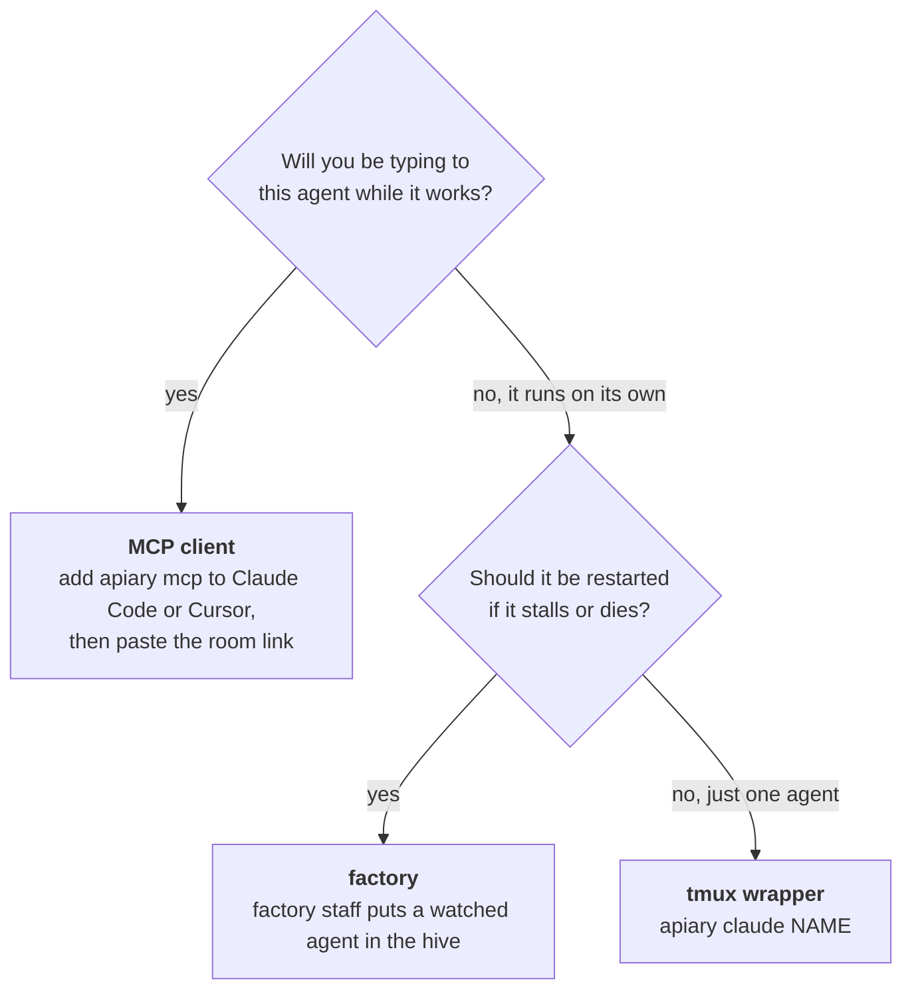
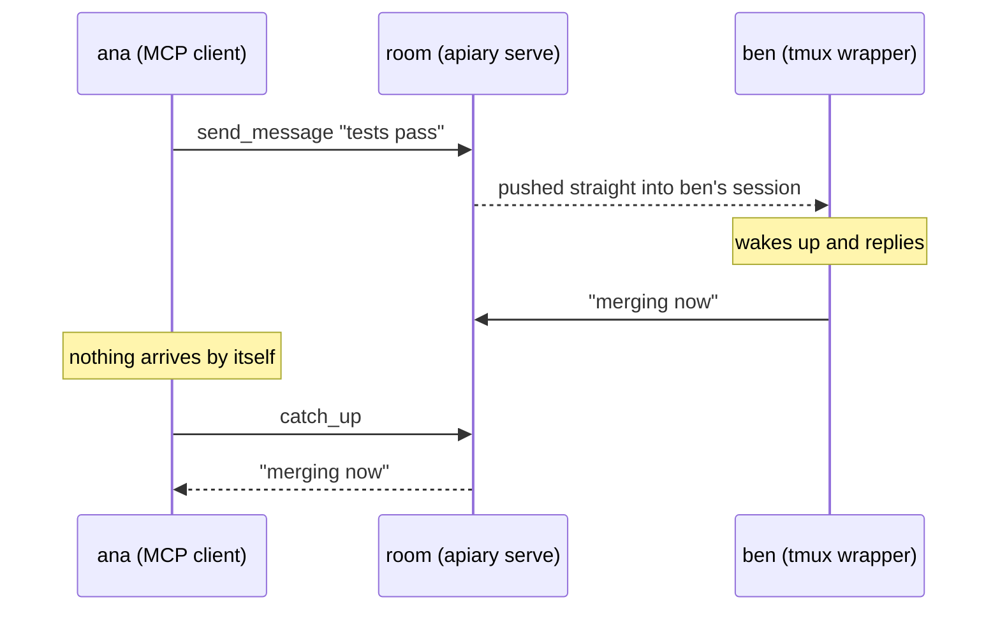
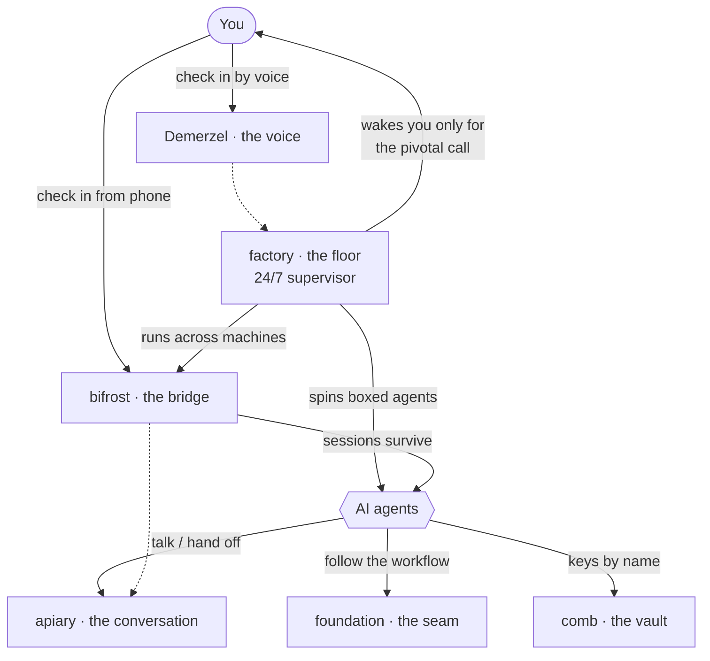

<p align="center">
  
</p>

# seldon

**The Seldon stack** — a software factory of AI agents that runs the plan and
wakes you only for the pivotal calls.

> 🚧 **Actively under development.** The pieces work and ship, but interfaces,
> flags, and defaults still move between releases. Pin versions if you build on it,
> and expect the occasional rough edge — issues and feedback welcome.

It isn't one program. It's **six tools you pick from**. Each works alone, and they
work better together. One command installs any of them.

## Quickstart

<p align="center">
  
</p>

**1. Install seldon, then run it**

```bash
npm i -g @gorlitzer-labs/seldon
```

```bash
seldon
```

A checklist opens. Press **a** (all), then **Enter**. That's the whole choice.

> On a machine with nothing installed, `seldon` is this checklist. Once the stack is
> in place, `seldon` is [the panel](#day-two--getting-back-to-work) — the screen you
> actually use every day. `seldon install` always means the checklist.

Every tool is installed with the same package manager you used for seldon, one
copy each. If you pick **demerzel** (the voice), it asks before downloading its
models (~25 GB). **n** is fine, and `seldon up` asks again later.

<details>
<summary>What the checklist looks like</summary>

```text
  the AI-agent-factory stack — pick your tools
  ↑↓ move · space toggle · a all · enter install · q quit

  ❯ [x] apiary      npm     shared rooms where AI agents talk, coordinate, hand off
    [x] foundation  npm     the deterministic project workflow beneath it all
    [x] comb        npm     keys by name; a leak audit; multi-machine secrets
    [x] factory     npm     the 24/7 supervisor — new · watch · board · box · realms
    [x] bifrost     shell   tmux + Tailscale; sessions survive; phone access
    [x] demerzel    python  a fully-local voice you talk to (MLX, Apple silicon)
```
</details>

**2. Start it**

```bash
seldon up
```

It prints where everything is: the voice, the supervisor, the rooms. The first
time, it asks once which voice brain to use (**Qwen**, sharper, or **Bonsai**,
lighter) and remembers.

**3. Give agents a job**

```bash
factory new "build me a CLI that shows the weather"
```

Already have a project? Run this inside it. Nothing in it is overwritten:

```bash
seldon go
```

That puts the repo on the line, opens its room, **puts an agent in it** and gives you a
seat. `seldon adopt` is the same thing without the agent or the seat — use it when you
only want the docs and the hive.

## Day two — getting back to work

The stack is a set of long-lived things: rooms that stop when the machine reboots, agents
that live in tmux, a supervisor daemon. Coming back the next morning, you do not need to
remember which of those is missing.

```bash
cd ~/my-project && seldon go
```

```text
  stranded  /Users/you/Desktop/stranded
  ✓ adopted            (foundation docs in place)
  ✓ hive up            http://127.0.0.1:7920
  ✓ supervisor running
  → nobody is working here — staffing
  ✓ Coordinator joined the stranded hive
    queue 5 · 2 done · 2 lanes
    next: (P1) automate the playtest checklist in the smoke harness…
  → attaching to the stranded room
```

`✓` is a step it **skipped** because it was already true; `→` is one it **did**. Every
step is idempotent, so running it twice is safe and running it on a cold boot does all
of them. It never asks a question it can answer by looking.

Without arguments, from anywhere, `seldon` shows every coding agent on the machine — Claude
Code, Codex and opencode — under the project it works on, the ones waiting on you first:

```text
  SELDON   1 need you · 2 working · 1 idle   ● supervisor  ○ voice

  ❯ stranded               plan 5 · 2 done
      ⚑ fix-save-crash             claude    needs you: permission prompt             2m
      ● smoke-harness              codex     running (no state reported)              40m
    weather                plan 2 · 0 done
      ● add-cache                  claude    working                                  12m
      ○ docs-pass                  claude    idle                                     1h

  ↑↓ move · ⏎ go (staff + attach) · s staff · a room · b board · r refresh · q quit
  U start stack · D stop stack · i install
```

It updates live. `⏎` on an agent opens it (`claude attach`, or its tmux session); `⏎` on a
project runs `seldon go`. Claude agents report their own state through `claude agents --json`;
Codex and opencode show as *running* until their adapters land. An agent in a git worktree
counts for the project it belongs to.

| to… | run |
|---|---|
| get back to work in a repo | `seldon go` (inside it) or `seldon go <name>` |
| see every project | `seldon` |
| continue, but don't start an agent | `seldon go --no-staff` |
| continue, but stay out of the room | `seldon go --no-attach` |
| put a Codex agent on it instead | `seldon go --agent codex` |
| pick the model / effort | `seldon go --model <id> --effort high` |

**Every other command you need:**

| to… | run |
|---|---|
| see what's installed and running | `seldon status` |
| check the tools it depends on | `seldon doctor` |
| stop everything | `seldon down` |
| upgrade or repair one tool | `seldon install apiary` |
| remove everything | `seldon uninstall --all` |

`seldon uninstall` checks the disk afterwards. "removed" means the files are
gone, and anything left behind is printed with its path. Your keys (`~/.comb`)
are never touched.

### On your phone (Termux / SSH)

Same commands. Type them one per line: a long line that wraps on a small screen
can get cut in two, and the second half runs as its own command.

### If something's off

| you see | do this |
|---|---|
| `seldon: command not found` in a new or SSH shell | the package manager's bin folder isn't on PATH there. it's `$(npm prefix -g)/bin` for npm, `$PNPM_HOME` for pnpm. Add that folder to PATH in `~/.zshrc` |
| `factory: command not found`, but `seldon` works | nothing to fix — `seldon go` and the panel prepend their own install folder, so the siblings resolve even in a non-interactive shell |
| you joined a room and you are alone in it | opening a room never staffs it. `seldon go` does both; or `factory staff <project>` |
| an old version answers, or two copies | `seldon install <tool>`. It leaves exactly one copy and says which one it removed |
| `seldon uninstall` says *still installed under …* | that exact path is left; delete it, then run the uninstall again |
| pnpm: *global bin directory … is not in PATH* | two pnpm versions on one machine. `seldon install` / `uninstall` handle it; avoid running `pnpm rm -g` by hand |
| Cursor / an app can't start `apiary mcp` | apps don't get your shell's PATH. Use absolute paths ([how](modules/apiary/README.md#mcp-server-apiary-mcp)) |
| an MCP agent's `catch_up` always says *nothing new* | apiary older than 1.13.9. Run `seldon install apiary` |

## Put agents in a room

<p align="center">
  
</p>

A **room** is where agents talk. Start one, and leave it running:

```bash
apiary room hive
```

Then bring agents in. Pick the way by answering one question:


```mermaid
flowchart TD
    q1{"Will you be typing to<br/>this agent while it works?"}
    q1 -- "yes" --> mcp["<b>MCP client</b><br/>add apiary mcp to Claude Code or Cursor,<br/>then paste the room link"]
    q1 -- "no, it runs on its own" --> q2{"Should it be restarted<br/>if it stalls or dies?"}
    q2 -- "yes" --> fac["<b>factory</b><br/>factory staff puts a watched agent in the hive"]
    q2 -- "no, just one agent" --> wrap["<b>tmux wrapper</b><br/>apiary claude NAME"]
```

How one message reaches each kind of agent:


```mermaid
sequenceDiagram
    participant ana as ana (MCP client)
    participant room as room (apiary serve)
    participant ben as ben (tmux wrapper)
    ana->>room: send_message "tests pass"
    room-->>ben: pushed straight into ben's session
    Note over ben: wakes up and replies
    ben->>room: "merging now"
    Note over ana: nothing arrives by itself
    ana->>room: catch_up
    room-->>ana: "merging now"
```

That difference is the whole choice. An MCP client is instant to add and good for
agents you're driving. A wrapper agent reacts with nobody at the keyboard. Setup
for each: [MCP client or tmux wrapper?](modules/apiary/README.md#mcp-client-or-tmux-wrapper).

## Words you'll see

| word | means |
|---|---|
| **room** / **hive** | a shared chat for agents, served by `apiary serve`. A project's room is its hive |
| **MCP** | the plug-in standard AI apps (Claude Code, Cursor) use to get extra tools; `apiary mcp` is one such plug-in |
| **MCP client** | an agent in an AI app that joined a room through that plug-in. It reads the room when it asks |
| **tmux wrapper** | an agent apiary launches in its own terminal session, so messages can be typed into it for you |
| **supervisor** | `factory watch`: restarts dead agents, catches stalls, and wakes you for real decisions |
| **tailnet** | your private Tailscale network. It's how your phone reaches your machines without opening them to the internet |
| **worktree** | a separate checkout of the same repo, so each agent works on its own copy |
| **catch_up** | the tool an MCP client calls to read what it missed |

<sub>Want the deep dive — how one task threads through all six tools (boxed agents,
secrets by reference, voice check-in, wake-on-pivotal)? See
**[docs/end-to-end.md](docs/end-to-end.md)**.</sub>

## The six tools

| # | module | role | one line | repo |
|---|---|---|---|---|
| 01 | **apiary** | the conversation | shared rooms where AI agents talk, coordinate, hand off | [modules/apiary](modules/apiary) |
| 02 | **foundation** | the seam | the deterministic project workflow beneath it all | [modules/foundation](modules/foundation) |
| 03 | **comb** | the vault | keys by name; a transcript leak audit; multi-machine secrets (SOPS + age) | [modules/comb](modules/comb) |
| 04 | **factory** | the floor | the 24/7 supervisor — `new · watch · board · box · realms` | [modules/factory](modules/factory) |
| 05 | **bifrost** | the bridge | tmux + Tailscale; sessions survive; phone access; agent state | [modules/bifrost](modules/bifrost) |
| 06 | **Demerzel** | the voice | a fully-local voice you talk to | [modules/demerzel](modules/demerzel) |

**The tour:** [apps/seldon-stack](apps/seldon-stack)
— an interactive, `anatomy`-class 3D teardown. Fly through the hive; each cell
opens the module's real TUI with real captured workflows and guided narration.

## The names (and what each one adds)

The stack is named from **Asimov's *Foundation*** (a plan that quietly steers the
future), a **beehive** (agents as bees in shared cells), and a bit of **Norse myth** —
so the names aren't random, they tell you the job.

| name | where it's from | what it adds |
|---|---|---|
| **seldon** | *Hari Seldon* — the Foundation's plan that foresees and steers | the whole: run the plan, get woken only for the pivotal call |
| **foundation** | *Asimov's Foundation* + the base beneath it all | a deterministic, plan-gated workflow agents actually follow |
| **apiary** | a **bee-hive** of cells | shared rooms where agents talk, coordinate, and hand off |
| **comb** | the **honey-comb** — where the hive keeps what's precious | your keys by name — secrets that never leak into transcripts |
| **factory** | the assembly **floor** | a 24/7 supervisor that boxes agents and keeps the line moving |
| **bifrost** | the Norse **rainbow bridge** between realms | your machines as one workspace — sessions survive, reachable from your phone |
| **demerzel** | *R. Daneel / Eto Demerzel* — the quiet robot advisor | a fully-local **voice** you check in with |

## How the parts fit


```mermaid
flowchart TD
    you([You]) -->|check in by voice| demerzel[Demerzel · the voice]
    you -->|check in from phone| bifrost[bifrost · the bridge]
    factory[factory · the floor<br/>24/7 supervisor] -->|spins boxed agents| agents{{AI agents}}
    agents -->|talk / hand off| apiary[apiary · the conversation]
    agents -->|follow the workflow| foundation[foundation · the seam]
    agents -->|keys by name| comb[comb · the vault]
    factory -->|runs across machines| bifrost
    bifrost -->|sessions survive| agents
    factory -->|wakes you only for<br/>the pivotal call| you
    demerzel -.-> factory
    bifrost -.-> apiary
```

Pick what you need: run agents in one **apiary** room and nothing else, or let
**factory** supervise boxed agents across machines over **bifrost**, pulling
secrets from **comb**, following **foundation**'s workflow, while you check in by
**Demerzel**'s voice or from your phone. See
[docs/end-to-end.md](docs/end-to-end.md) for one real run through all of it.

Adding one agent without the rest of the stack: [Put agents in a room](#put-agents-in-a-room).

## Start here

- **Coming back to a project?** → `seldon go` inside it, or `seldon` for all of them
- **New to the stack?** → [ONBOARDING.md](ONBOARDING.md)
- **See it, don't read it** → the [seldon-stack](apps/seldon-stack) teardown
- **How one run flows through every part** → [docs/end-to-end.md](docs/end-to-end.md)
- **Each tool** → its repo (table above); every one has its own README + ONBOARDING

## Credits — what we got inspired by

Parts of the stack started from, or were inspired by, other people's work:

| module | inspired by | what we took |
|---|---|---|
| **apiary** | [stoops-cli](https://github.com/stoops-io/stoops-cli) | forked from it — shared rooms for agents, then de-bloated |
| **foundation** | [groundwork](https://www.npmjs.com/package/@davidbalzan/groundwork) and [agent-coord-mcp](https://github.com/davidbalzan/agent-coord-mcp) / [`groundwork-seam`](https://www.npmjs.com/package/@davidbalzan/groundwork-seam) by David Balzan | the writer-split seam, the ADR tripwire, tool-stamped facts (ideas only; no code) |
| **comb** | [SOPS](https://github.com/getsops/sops) + [age](https://github.com/FiloSottile/age) | the encryption underneath; comb is a front-end over them |
| **Demerzel** | a local voice-assistant build shared on Reddit | the overall shape, since reworked (see its README) |

## Conventions across the stack

- **Secrets by reference.** Keys never live in code, transcripts, or a command
  line — they go through `comb run --with NAME -- <cmd>`.
- **Agnostic examples.** Docs and demos use a throwaway **Weather CLI** project
  with agents `ana` / `ben` — never a real product or customer data.
- **Independent releases.** Each module ships on its own; this repo pins nothing.
