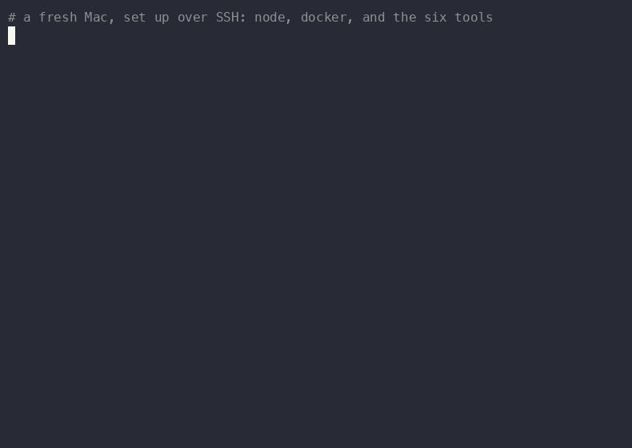
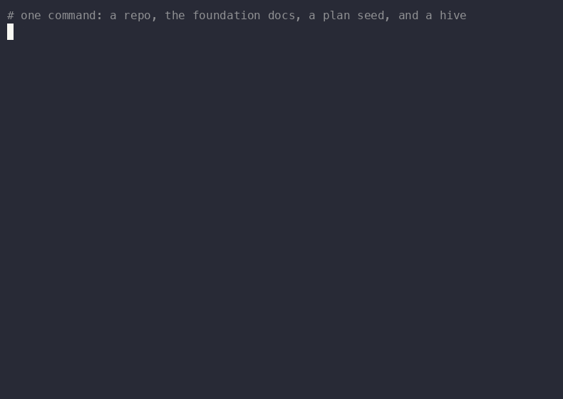
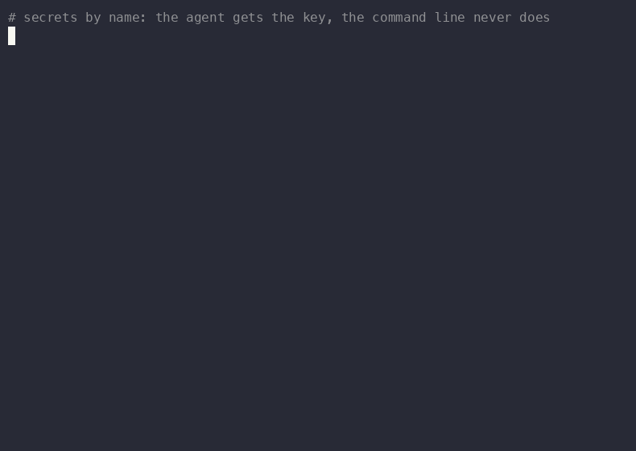
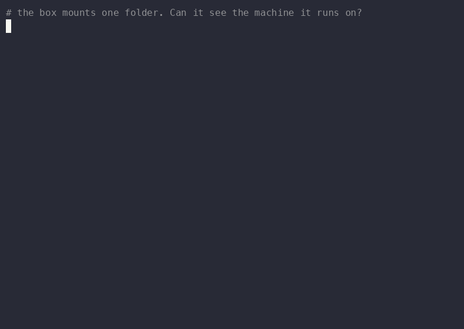
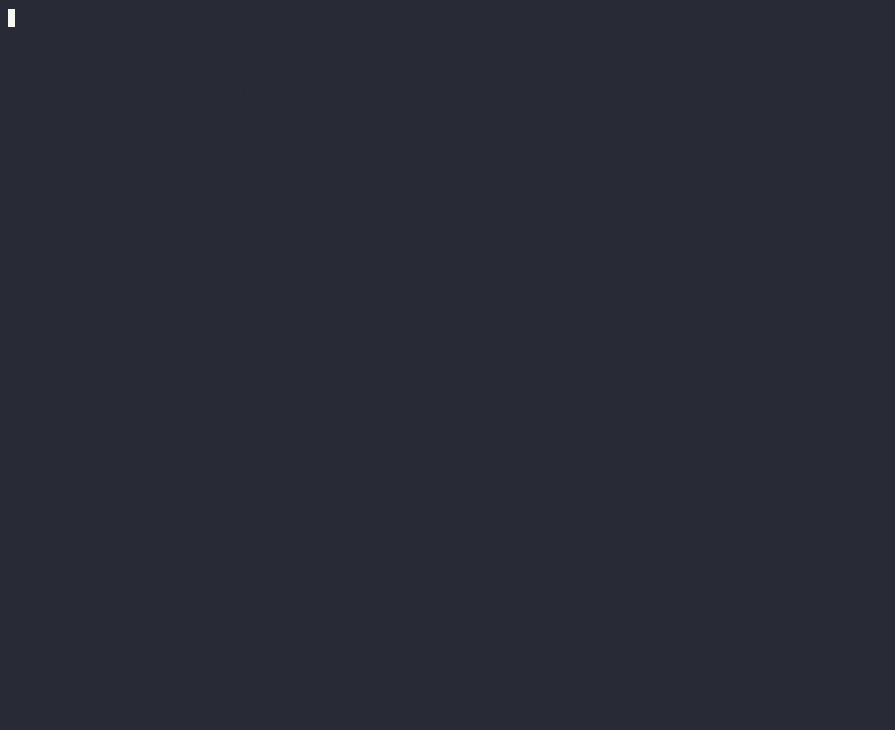

# A real run, on a fresh Mac

[docs/end-to-end.md](end-to-end.md) tells the story of one task going through all six tools. This
is the same shape **actually run**: a Mac with nothing on it, set up over SSH, building a small
project with an agent that is sealed in a box. Every command and every clip below is from that
run. Nothing is mocked, and the things that went wrong are written down (see
[What went wrong](#what-went-wrong)) because that is the part you will hit too.

The project is the usual agnostic one: a **Weather CLI** (`weather <city>`, plus a `--units`
flag). Allow an hour the first time; most of it is installs and approvals.

You will end up with:

- a second machine on your tailnet that is part of the fleet (bifrost) and can read your secrets
  (comb) without you copying a single key by hand;
- a project line made by `factory new`, with the task in the queue, stamped with who added it;
- an agent with permissions skipped that builds the project **inside a container that cannot see
  the host**, signed in with a token that never appears on any command line;
- the evidence for both claims, which you can re-run.

## 0. What you need

- A Mac on Apple silicon with [Homebrew](https://brew.sh), Node 22 and [Tailscale](https://tailscale.com).
- Another machine that already has the stack (this guide calls it *the main machine*).
- A Claude subscription. The box signs in with a long-lived token, so no API key is needed.

## 1. Put the stack on the new machine


[(mp4)](media/real-run/1-a-fresh-mac.mp4)

```bash
npm i -g @gorlitzer-labs/seldon
seldon install comb apiary factory foundation bifrost
seldon doctor
```

`seldon doctor` checks node, tmux, sops, age, tailscale and python. Two things came up on a Mac that
was set up over SSH:

- **tailscale ✗** when only the Tailscale *app* is installed: the app has no `tailscale` on your
  PATH. A one-line wrapper fixes it:
  ```bash
  printf '#!/bin/sh\nexec /Applications/Tailscale.app/Contents/MacOS/Tailscale "$@"\n' > ~/.local/bin/tailscale
  chmod +x ~/.local/bin/tailscale
  ```
- **`comb`, `factory`, … "node: not found" over SSH.** Non-interactive shells do not load your
  `.zshrc`, so nvm's node is not on PATH. Put the default node on PATH in `~/.zshenv`, which every
  shell reads.

(Demerzel, the voice, needs MLX and its own Python venv. This run leaves it out.)

## 2. Join the fleet: bifrost and comb

From the main machine:

```bash
bifrost realm add <name>        # asks for the SSH user — it defaults to YOUR local user, not the remote's
bifrost doctor                  # ssh, tmux, tmux.conf synced
```

If `ssh <name>` does not resolve (MagicDNS short names often do not on macOS), add a `Host <name>`
block with the tailnet IP to `~/.ssh/config` — bifrost uses whatever name you gave it.

comb is a vault with one **age** key per machine. The new machine makes its own key, and the main
machine grants it read access:

```bash
# on the new machine
comb init
comb pubkey                     # prints age1…  (a public key — safe to paste anywhere)

# on the main machine
comb realm add <name> age1…     # re-encrypts the store for one more recipient
scp ~/.comb/secrets.yaml <name>:.comb/secrets.yaml   # the store is ciphertext; copying it leaks nothing
```

Then `comb ls` on the new machine lists the names. Adding a realm lets that machine read **every**
secret, and revoking later does not un-leak what it already read: revoke *and* rotate. Decide that
on purpose.

## 3. Docker, for the box

`factory box` needs a container engine. On a headless Mac, Docker Desktop is a poor fit: its
installer needs an admin password and a screen. [Colima](https://github.com/abiosoft/colima) runs a
small Linux VM and installs through brew with no password:

```bash
brew install colima docker docker-buildx
colima start --cpu 4 --memory 6 --disk 40
docker version --format '{{.Server.Version}}'
```

`factory box` builds its image the first time you use it (factory 0.2.4 or newer;
[#92](https://github.com/gorlitzer-labs/seldon/pull/92)), so there is nothing to do. **On 0.2.3 or older**
the published package leaves out the Dockerfile, so build the image once by hand:

```bash
curl -fsSL https://raw.githubusercontent.com/gorlitzer-labs/seldon/main/modules/factory/agentbox/Dockerfile \
  | docker build -t factory-agentbox -
```

`factory box` builds the image only if it is missing, so after this it just works. (Check with
`factory --version`, or upgrade: `npm i -g @gorlitzer-labs/factory@latest`.)

## 4. Give the box its login — once, by name

The box has its own empty home on purpose: it cannot read your `~/.claude`. So it needs a login of
its own. A **long-lived token** does it once for the whole fleet:

```bash
claude setup-token            # approve in the browser, paste the code back; it prints a token
comb set CLAUDE_CODE_OAUTH_TOKEN   # paste the token at the hidden prompt
```

Copy the token with a triple-click so wrapped lines stay together. **Our first paste was truncated
(85 characters instead of 108)** and the box answered `401 OAuth access token is invalid`, which
reads like a broken stack and is not. Check the length without ever printing the value:

```bash
comb run --with CLAUDE_CODE_OAUTH_TOKEN -- sh -c 'echo ${#CLAUDE_CODE_OAUTH_TOKEN}'
```

## 5. Make the line


[(mp4)](media/real-run/2-factory-new.mp4)

```bash
factory new "a tiny Weather CLI that prints the current temperature for a city" \
  --dir ~/Desktop/weather-demo --name weather-demo --port 7921
```

That is four steps: a repo, the foundation docs, a PRD seed with a planning item, and a hive.
`factory new` takes the first free port from 7920 (0.2.4 or newer). We passed `--port 7921` in the
recording because a hive from an earlier project was already running on 7920 and we were on 0.2.3, which
always used 7920 (see the table below). Then the task goes in through the tool, never by hand-editing:

```bash
cd ~/Desktop/weather-demo
FOUNDATION_AGENT=you foundation queue "(P1) Build the Weather CLI: node, no dependencies, weather <city> prints the current temperature using the free Open-Meteo API (no key). Add a --units metric|imperial flag (default metric). Include node:test tests and a README example."
```

The tool writes `added: … by: you` under the item. That line is why `foundation doctor` can call an
item with no author *drift*: the queue is an instruction channel, so an item nobody can account for
is one the pipeline would otherwise treat as authorised.

## 6. Prove the secret stays off the command line


[(mp4)](media/real-run/3-secrets-by-name.mp4)

comb's promise is that a stored value is never a command-line argument, because argv is visible to
every process on the machine. Do not take that on trust. [`argv-check.sh`](media/real-run/argv-check.sh)
snapshots the whole process table while a command runs with the secret, and counts command lines that
contain the token's shape:

```bash
comb run --with CLAUDE_CODE_OAUTH_TOKEN -- sh ./argv-check.sh
# processes whose command line holds the token: 0
# token present in this script's environment:   yes
```

Two traps we fell into, so you do not have to:

- **The check matched itself.** Our first version was `sh -c '… | grep -c sk-ant …'`: the search
  pattern sits inside that `sh -c` string, which is a process's command line, so it found itself and
  reported `1`. Keep the check in a **file**, take the process snapshot **before** the search tool
  starts, and build the pattern at run time. Our own `ssh` wrapper did the same thing once more: a
  leak scan typed into the same `ssh` command showed up as a match. Run the scan in a separate call.
- **A check that has never failed is not a check.** Plant a leak on purpose and make sure it is seen:
  ```bash
  T=$(comb run --with CLAUDE_CODE_OAUTH_TOKEN -- sh -c 'printf %s "$CLAUDE_CODE_OAUTH_TOKEN"')
  sh -c 'sleep 6; true' "$T" &        # the token, in a live process's arguments
  sleep 1; sh ./argv-check.sh | head -1    # → 1
  ```
  (`sh -c 'sleep 6' "$T"` with a single command does not work: the shell replaces itself with
  `sleep` and the argument vanishes.)

We also sampled the whole process table continuously while running `comb run` fifteen times: 86
samples, zero sightings of the token, against 30 of 45 samples when a leak was planted on purpose.

## 7. The box


[(mp4)](media/real-run/4-the-box.mp4)

The agent runs with permissions skipped. That is what lets it do a day's work without a human
tapping *allow*, and it is also why it must not run on the host, where it could read `~/.ssh`, the
GitHub login and every repo. `factory box` moves the bypass into a container that mounts **one
folder**:

```bash
factory box . --with CLAUDE_CODE_OAUTH_TOKEN
```

From inside, the host's `/Users/<you>/.ssh` and `/Users/<you>/.config/gh` do not exist, and neither
does `/Users`. What the box does **not** hide is the credential it is given: the token is readable
inside, because the agent has to use it. It hides the *other* secrets.

> **`factory staff` is not this.** `factory staff <project>` starts its coordinator as
> `claude --dangerously-skip-permissions` **on the host**, with no box, and `factory new` prints it as
> the next step. For a sealed agent use `factory box`.

## 8. Build, then check


[(mp4)](media/real-run/5-the-build.mp4)

Inside the box:

```bash
claude -p "Read docs/QUEUE.md and docs/PRD.md. Take the queue item that starts with Build the Weather CLI and implement it exactly as written; leave the other queue item alone. First set a local git identity (ana, ana@example.invalid). Run the tests. Commit on a branch named feat/weather-units. Do not push. Finish with a 5 line summary." --dangerously-skip-permissions
```

It built the CLI with no dependencies, six `node:test` tests, a README, and committed on
`feat/weather-units`. Then it reported that it had **not** called the live API. So we did, in the same
box:

```
$ npm test 2>&1 | grep -E "^# (tests|pass|fail)"
# tests 6
# pass 6
# fail 0
$ node bin/weather.js Berlin
Berlin: 18.3°C
$ node bin/weather.js Berlin --units imperial
Berlin: 64.9°F
$ node bin/weather.js Berlin --units kelvin; echo "exit=$?"
Invalid --units "kelvin": expected metric or imperial
exit=1
```

18.3 °C is 64.94 °F, so the two live answers agree. Do not skip this step: the agent's own summary is
a claim, the second block is evidence, and here they differ in exactly one line.

## What went wrong

Everything below happened in this run.

| What you see | Cause | What to do |
|---|---|---|
| `factory box`: `unable to prepare context: path ".../agentbox/" not found` | The npm package omits the Dockerfile ([#92](https://github.com/gorlitzer-labs/seldon/pull/92)) | Upgrade to 0.2.4 or newer; on older versions build the image once, §3 |
| `factory box doctor`: `REACHABLE .claude — the box is not sealed` | The doctor counted the box's *own* `~/.claude` (the fleet home) as a host leak ([#92](https://github.com/gorlitzer-labs/seldon/pull/92)). Inside the box, `/Users` and `/host` do not exist | Cosmetic; fixed in 0.2.4 (the shipped doctor reports all five paths sealed in this exact state). The proof in §7 was never affected |
| `factory new`: `hive did not report startup in 15s` | A second `factory new` reused the fixed port 7920 ([#92](https://github.com/gorlitzer-labs/seldon/pull/92)) | Fixed in 0.2.4; on older versions pass `--port 7921` |
| `401 OAuth access token is invalid` in the box | A truncated paste of the token | §4: copy whole, check the length |
| `factory staff` stops at *"Bypass Permissions mode"* | It runs an unboxed agent on the host and waits for you to accept | Use `factory box` instead |
| An agent says it cannot find `docs/QUEUE.md` | `docs/` is **untracked**, so `git clean -fd` deleted it. Our own reset script did this once, and the agent correctly refused to guess the spec | Reset with `git clean -fd -e docs …`, and look at `git clean -n` first |
| `seldon doctor`: tailscale ✗ | Only the Tailscale app is installed | The wrapper in §1 |
| `comb`: `node: not found` over SSH | Non-interactive shells skip `.zshrc` | Put node on PATH in `~/.zshenv` |
| `bifrost realm add` fails to connect | It defaulted the SSH user to your local user; short tailnet names did not resolve | Give the remote user; add a `Host` block |

## Re-record the clips

The clips are [asciinema](https://asciinema.org) recordings rendered with
[agg](https://github.com/asciinema/agg); the `.cast` files sit next to the videos. Each scene was a
small script that types a command at human speed and then **really runs it**, so the output is
genuine and the pace is readable:

```bash
asciinema rec --cols 112 --rows 32 -c "bash scene.sh" scene.cast
agg --theme dracula --font-size 16 --idle-time-limit 2 scene.cast scene.gif
ffmpeg -i scene.gif -movflags +faststart -pix_fmt yuv420p -vf "scale=trunc(iw/2)*2:trunc(ih/2)*2" scene.mp4
```

Scrub your username and any `token=` out of the casts before you publish them: the hive prints a join
URL that carries a member token. Ours were scrubbed, and checked for the token's shape.

See the same run, as a guided tour, in the **A real run** chapter of the
[seldon-stack site](../apps/seldon-stack).
